# OneCard-MultiPlayer-

C# .Net 으로 MutilThread Socket 을 이용 한 원카드(멀티)게임입니다.

## 실행 파일

<https://github.com/psk876/OneCard-MultiPlayer-/raw/master/CardGameLand/bin/Debug/CardGameLand.exe>

## 영상

# 게임 규칙

게임 인원은 2~6 인 입니다.

게임 진행 순서는 호스트에 접속 한 순서입니다.

시작 기준은 호스트 입니다.

시작 카드는 5장입니다.

보이게 뒤집어 놓은 카드 뭉치의 맨 위에 있는 카드와 동일한 숫자 또는 무늬의 카드를 뭉치 위에 계속해서 한 장씩 올려놓으면서, 자신의 모든 카드를 소모하면 승리합니다.

자신을 제외한 모두가 파산(소유 카드가 12장을 초과하는 사람)이 되면 승리합니다.

예를 들어, 정통 룰 기준 ♥5가 제시되어 있다면 같은 하트 무늬의 카드 중 하나(♥2, ♥3, ♥4, ♥6, ♥7, ♥8, ♥9, ♥10, ♥J, ♥Q, ♥K, ♥A)나 ♠5, ♣5, ♦5 중 한 장만 낼 수 있다.

만약 자기가 가진 카드 중에서 올려놓을 수 있는 카드가 없다면 대신 카드 한 장을 가져가고 다음 사람에게 순서를 넘겨야 한다.

카드 뭉치의 카드가 전부 사라지면, 이미 쌓인 카드를 맨 위의 카드만 남겨놓고 다시 섞어서 엎어놓아 카드 뭉치를 만든다.

그리고 자기가 가진 카드가 한장 일 때, '원 카드'를 클릭해야 승리할 수 있다.

## 능력을 갖춘 카드

### 공격계열 카드

#### '2'카드

능력 : 자신의 다음 차례 사람에게 2장을 먹인다.

상대가 다른 무늬 2를 냈을 때 지원공격이 가능하다.

#### 'A'카드

능력 : 자신의 다음 차례 사람에게 3장을 먹인다.

상대가 다른 무늬 A를 냈을 때 지원공격이 가능하다.

### 기능 계열 카드

#### '3'카드

능력 : 같은 모양의 2를 방어할 수 있다.(속칭 방어.)

방어에 성공한 경우 먹여야할 장수를 0장으로 바꾼다.

#### '7'카드

능력 : 카드를 낸 후에 자신이 원하는 무늬로 바꿀 수 있다.(속칭 체인지.)

#### 'J'카드

능력 : 현재 진행 방향으로 한 사람을 건너 뛰어 그 다음 사람에게 차례를 넘긴다.(속칭 점프.)

#### 'Q'카드

능력 : 현재 진행자의 이전 차례의 플레이어로 차례가 넘어간다.

#### 'K'카드

능력 : 한번 더 자신의 차례가 된다. 즉, 카드를 한 장 더 낸다.

### 파산

소지하고 있는 카드 수가 7장 초과시

# 설명

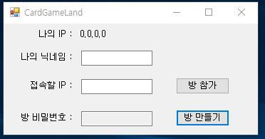

메인 폼 입니다.

자신이 방을 만들 것인지 참여할 것인지 정해야 합니다.

방을 만든다면 방을 만들고 참가하려고하는 사람들에게 IP 주소를 알려줘야 합니다.

상단에 자신의 IP를 알려줍니다.

이미지에서는 IP를 따로 설정하진 않았습니다

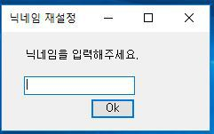

데이터베이스를 이용하지 않기 때문에 닉네임 중복이 발생할 수가 있습니다.

참가 시 중복된 닉네임이 있을경우 재설정해야합니다.

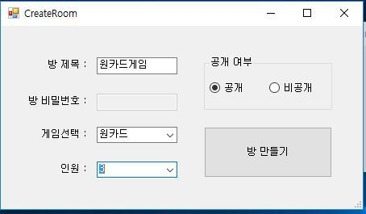

방만들기 폼입니다.

위와 같이 설정하고 방을 만들어줍니다.

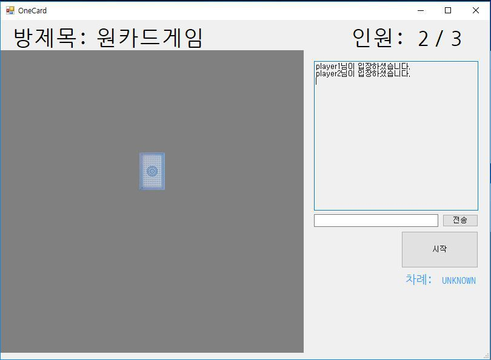

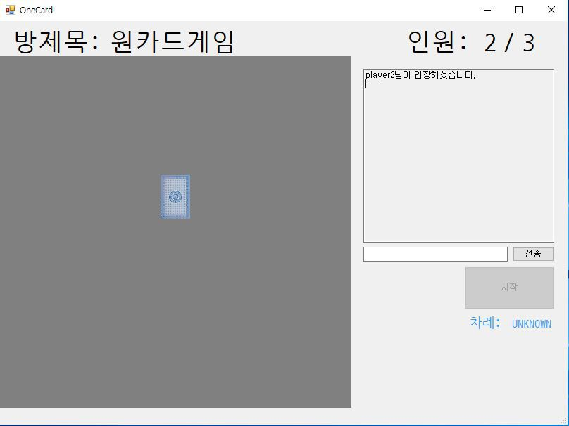

호스트(Server)의 경우에만 시작 버튼이 활성화되어있습니다.

시작 버튼이 활성화되거나 최대인원에 도달했을 경우에는 더는 참가자를 받지 않습니다.

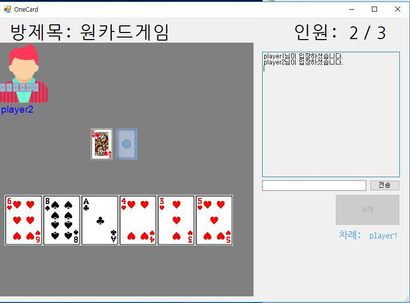

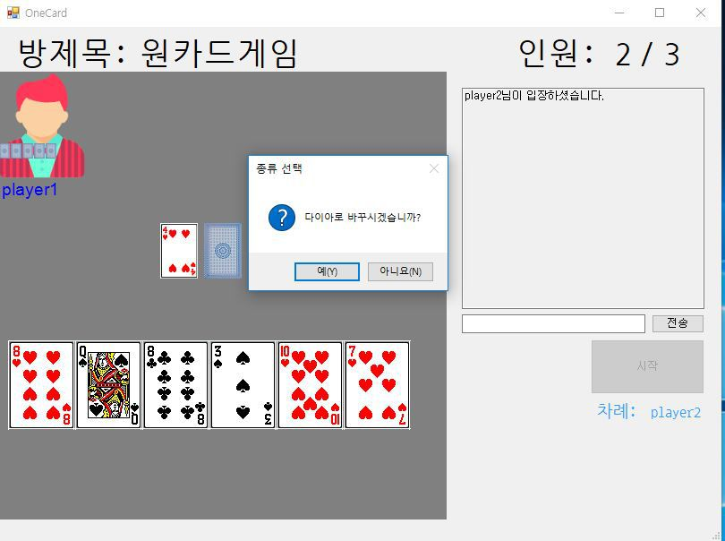

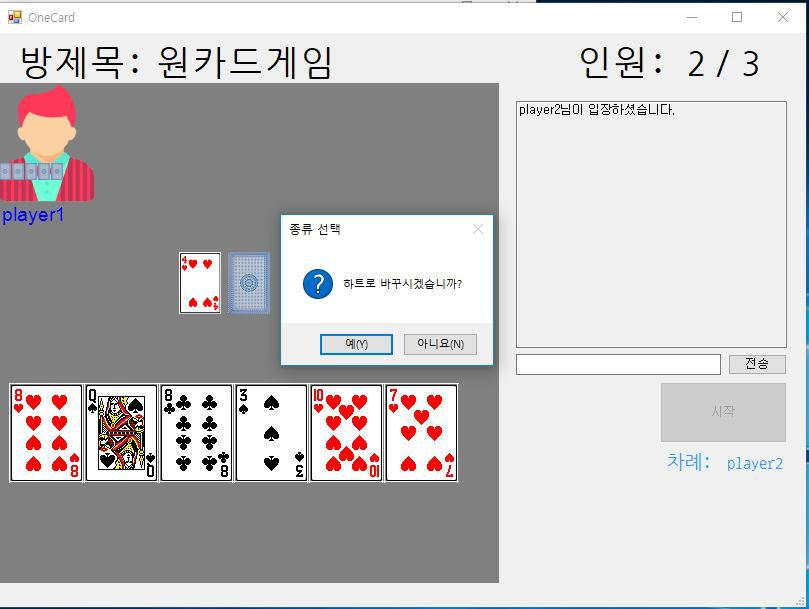

숫자 카드 7을 낼 경우에는 총 4단계로 물어보고 하나를 선택합니다.

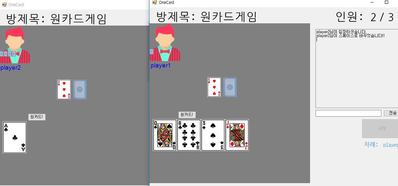

플레이어 중 한 명이 카드 한 장이 남게 되면 원 카드 버튼이 임의의 위치에 생성됩니다.

카드 한 장이 남은 플레이어 외의 다른 플레이어가 버튼을 누르면 카드 한 장이 남은 플레이어가 한장 드로우 합니다.

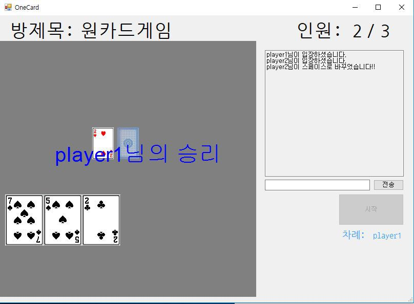

플레이어 카드가 7장 이상이 되면 죽게 됩니다.

모든 플레이어가 죽거나 나가게 되면은 남은 플레이어가 승리하게 됩니다.

# Class Diagram

## Deck

## Server

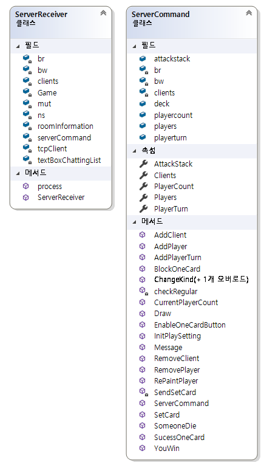

## Client

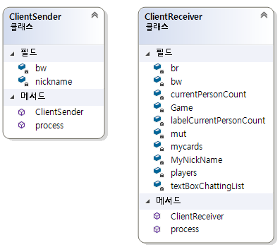

## Command

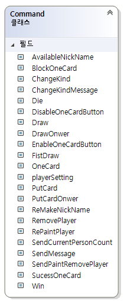

## Player

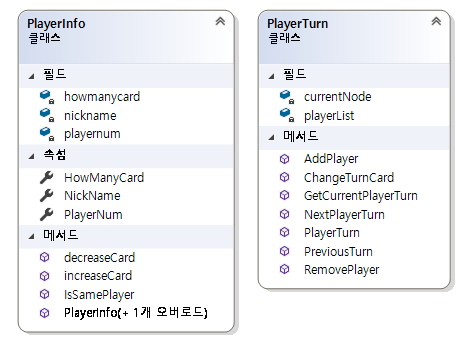

## RoomInfo

## Forms

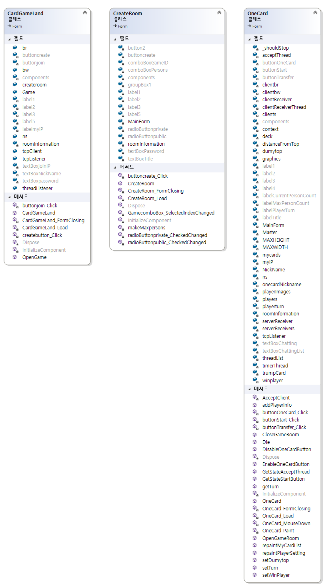

